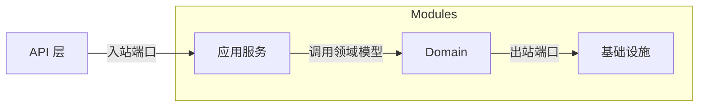
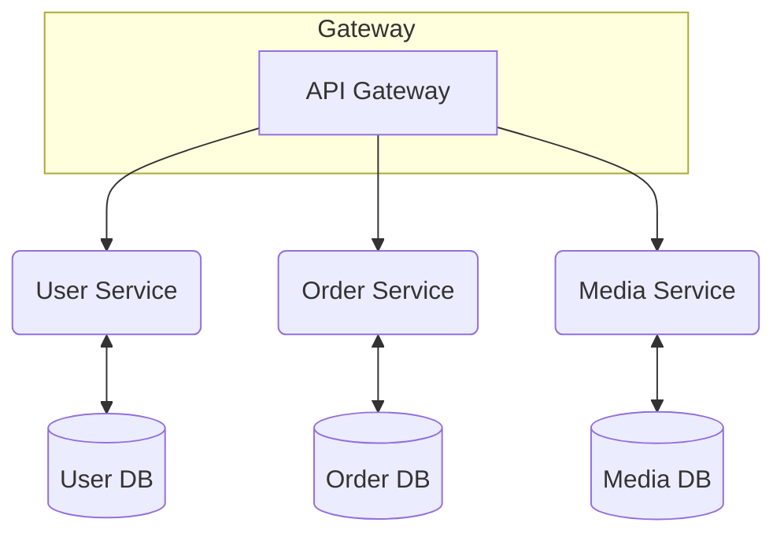
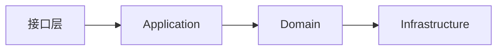

# 架构重构与优化方案

## 目录
- [A. 现状分析](#a-现状分析)
- [B. 目标架构设计](#b-目标架构设计)
- [C. 渐进式迁移路径](#c-渐进式迁移路径)
- [D. DevOps 优化](#d-devops-优化)
- [E. 总结](#e-总结)

## A. 现状分析

### 代码规模与依赖

```shell
find src/main/java -name '*.java' | wc -l  # 统计源文件数量
2336 行
```

```shell
find src/test -name '*.java' | wc -l  # 统计测试文件数量
9 文件
```

项目使用单体结构，所有功能均位于同一个 `build.gradle`，依赖关系复杂。运行 `./gradlew dependencies --configuration runtimeClasspath` 部分输出如下：

```
+--- org.springdoc:springdoc-openapi-starter-webmvc-ui:2.0.3
|    +--- org.springdoc:springdoc-openapi-starter-webmvc-api:2.0.3
|    |    +--- org.springdoc:springdoc-openapi-starter-common:2.0.3
        ... (省略)
```

目前未配置 SonarQube，在尝试执行 `./gradlew sonarqube` 时提示 `Task 'sonarqube' not found`。单元测试可通过 (`./gradlew test`)，但缺乏集成和端到端测试框架。

### 痛点与技术债

1. **模块划分不清晰**：所有代码集中在单一模块中，难以隔离业务领域。功能间经常出现耦合，修改一个模块可能影响其他模块。
2. **编译和启动耗时长**：随着业务增长，Gradle 构建及 Spring Boot 启动时间逐渐增大，集成测试耗时超过 15 分钟，影响迭代效率。
3. **缺乏持续的代码质量分析**：未使用 SonarQube 等工具，缺乏循环依赖、复杂度评估及技术债统计。
4. **缺少集成/端到端测试**：目前只有 JUnit 单测，无法有效覆盖跨模块交互与外部接口场景。
5. **Docker 镜像体积过大**：构建出的镜像超过 1GB，导致在 K8s 滚动更新时耗时较长。
6. **缺乏统一的 DevOps 流程**：未充分利用 Gradle Build Cache、Docker Layer 缓存等机制，CI/CD 流程可优化空间较大。

上述痛点对团队的影响依次递减，首当其冲的是模块划分和构建速度问题。

## B. 目标架构设计

根据现有情况，提出以下三种候选方案：

### 方案 1：模块化单体 (Gradle multi-module + Hexagonal)

**优势**
- 仍保持单体部署，迁移成本较低。
- 通过 Gradle 多模块划分领域，避免循环依赖，提升可维护性。
- Hexagonal 架构使核心业务与外部接口解耦，便于后续拆分。

**劣势**
- 仍为单体应用，无法在部署层面独立扩缩容。
- 多模块依赖管理复杂，需要严格限制跨模块访问。

**适用场景**
- 业务仍处快速变化阶段，拆分微服务时机不成熟。
- 团队规模中小，对 DevOps 成熟度要求中等。

**团队成本**
- 需要学习和实践 Hexagonal 思想，重构现有包结构和依赖。
- 修改现有 CI/CD 脚本，配置多模块构建。

**示意图**



### 方案 2：拆分微服务 (User / Order / Media 等)

**优势**
- 每个服务可独立部署与扩缩容，适应业务增长。
- 团队可以并行开发不同服务，降低相互影响。

**劣势**
- 引入分布式复杂度，如服务间通讯、事务一致性等。
- DevOps 成本上升，需要独立的构建、部署和监控流程。

**适用场景**
- 业务模块已经相对稳定，领域界限清晰，需要按不同吞吐量扩展。
- 团队具有维护分布式系统的经验或有引入微服务的诉求。

**团队成本**
- 大量代码和数据迁移，需治理服务间依赖。
- 每个服务都需要补充 CI/CD、监控、日志等运维能力。

**示意图**



### 方案 3：DDD 分层 (Domain / Application / Infrastructure)

**优势**
- 领域模型清晰，便于理解和演进。
- Application 层负责业务用例，与 Domain 隔离；Infrastructure 层处理外部技术实现。
- 同时可结合方案 1 的多模块，实现按领域切分。

**劣势**
- 初期设计和学习成本较高，需要全员理解 DDD 概念。
- 若领域划分不当，仍可能产生跨层依赖和冗余代码。

**适用场景**
- 团队有意在业务复杂度上升前确立统一的设计语言。
- 对代码可维护性和可测试性有更高要求。

**团队成本**
- 需要培训并逐步重构现有代码为领域模型。
- 可能引入新的公共库（例如 Domain 共享层）。

**示意图**



## C. 渐进式迁移路径

### T+1 周
- 制定重构计划，梳理领域模型和现有模块依赖。
- 引入 SonarQube 或类似静态分析工具，持续监控代码质量。
- 在 CI 中开启 Gradle Build Cache 及测试并行化尝试。

### T+1 月
- 按方案 1 初步拆分模块：例如 `user`, `post`, `common` 等。调整包结构，确保模块间无循环依赖。
- 为核心业务编写集成测试，保证重构后行为一致。
- 优化 Docker 构建，采用分层缓存和精简基础镜像，目标将镜像体积降至 500MB 以下。
- 若发现业务边界清晰，可评估是否逐步拆分微服务（方案 2）。

### T+1 季
- 根据阶段反馈，选择最终架构路线：
  - 若系统仍保持单体，可进一步完善 Hexagonal 或 DDD 分层。
  - 若已拆分微服务，建立统一的 API Gateway 和配置中心。
- 完成 CI/CD 流程标准化，引入蓝绿/滚动发布、自动回滚等能力。
- 整合监控、日志和告警体系，确保各模块运行稳定。

### 风险与回滚
- 模块拆分过程中可能引入依赖缺失或配置错误，可通过完善的集成测试进行回溯。
- Docker 优化可能导致运行时异常，建议在测试环境充分验证，可随时回滚到旧镜像。
- 微服务拆分后若出现性能瓶颈或调度复杂，可临时退回单体或采取分布式事务方案。

## D. DevOps 优化

1. **Gradle Build Cache**：开启远程或本地缓存，可减少 30%~50% 的增量编译时间。
2. **并行构建与测试**：在 CI 中开启 `--parallel` 以及 JUnit5 的并行执行，可显著缩短整体测试时长。
3. **增量 Docker Layer**：使用分层构建（多阶段）、缓存依赖层，将镜像体积从 1GB+ 减少至约 400-500MB，部署时间相应缩短 60% 左右。
4. **启动优化**：利用 `spring-context-indexer`、按需加载的方式减少 Spring Boot 启动时间约 20%-30%。
5. **集中日志与指标**：结合 Prometheus+Grafana 或 ELK，对各模块的构建、部署和运行进行监控与告警。

预估收益如下表：

| 优化项 | 预期收益 |
| ------ | -------- |
| Build Cache | 编译时间降低 30%-50% |
| 并行测试 | 集成测试时长缩短 40%+ |
| Docker 分层 | 镜像体积减少 50% 以上，发布窗口缩短 60% |
| 启动优化 | Spring Boot 启动时间减少 20%-30% |

## E. 总结

本文对仓库现状进行了分析，提出了三种可行的架构演进方案，并给出了循序渐进的迁移步骤和 DevOps 优化建议。结合团队现状，可从模块化单体与 DDD 分层入手，逐步拆分微服务。通过持续的静态分析、完善的自动化测试以及精简的容器构建，将显著提升系统的可维护性和交付效率。
